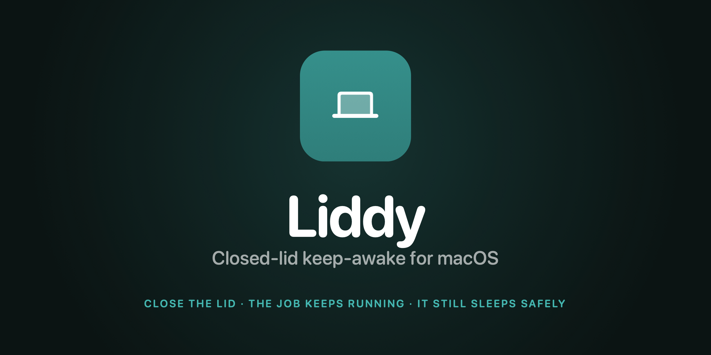
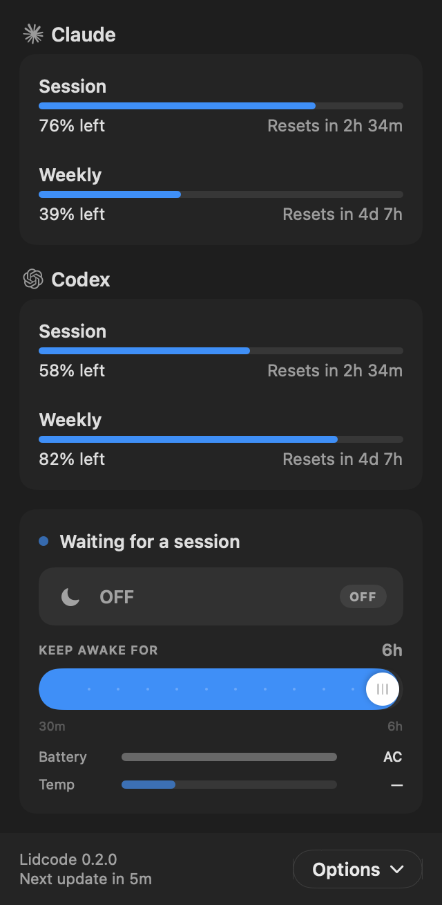
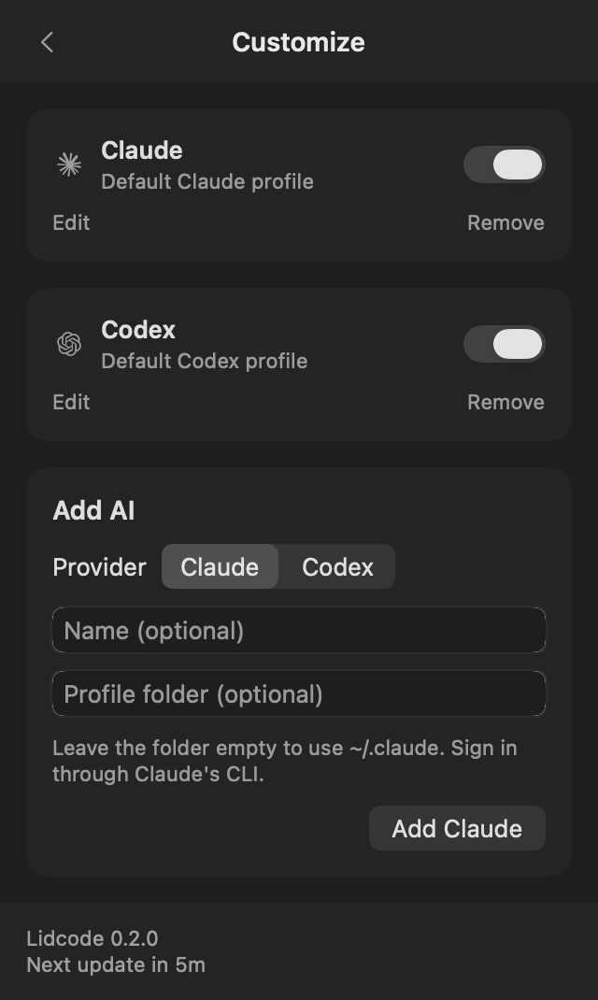
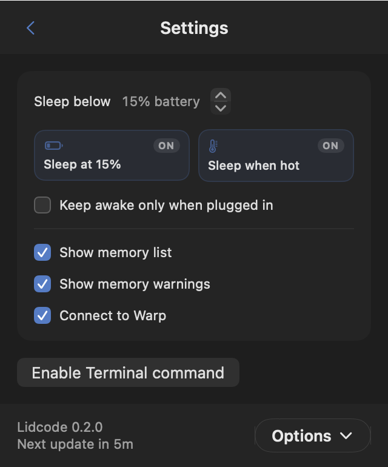

<p align="center">
  
</p>

# Lidcode

Track your Claude and Codex limits and keep your Mac awake while your AI works.
Lidcode uses OpenUsage 0.7.13's native provider-card layout, with configurable AI
profiles and Lidcode's guarded keep-awake controls.

**[Download Lidcode for Mac](https://github.com/princewagan/lidcode/releases/latest)** · **[Setup guide](docs/INSTALL.md)**

Requires macOS 14+ on Apple silicon. Open the DMG, drag the app to Applications,
then open it. The public build is not notarized; see the setup guide if macOS
blocks the first launch. The app includes the CLI and optional closed-lid helper.
No Python, Swift toolchain, or source checkout is needed to use the download.

### Your AI accounts

Open **Options → Customize** to add Claude or Codex, name a profile, or choose a
custom CLI profile folder. Default installed profiles are detected on first launch.
Adding another account creates a separate CLI profile folder and opens sign-in in
Terminal. Choose the intended account in the browser; use **Sign In** to reconnect
an existing profile. Lidcode keeps credentials on your Mac. Accounts previously
sharing a folder are separated automatically; the first keeps its existing login.
Each account has its own 5h and 1w switches under **Menu bar usage**. Usage cards
have at most three columns: four accounts use 2×2, five use 3×2, and additional
accounts add rows. Session and weekly meters show **left** or **used**, with
reset countdowns, outdated-reading labels, and explicit unavailable states.

Claude uses its usage endpoint; Codex uses local CLI session logs. Usage refreshes
natively every five minutes and with **⌘R**. Other AI tools can still use Lidcode's
process watching and CLI work leases; this release's usage cards support Claude
and Codex. AI profile configuration is stored in `~/.lidcode/ai-profiles.json`.

| Dashboard | Customize | Settings |
|---|---|---|
|  |  |  |

### Your agent is still working. You want to close the lid and go to bed.

Every keep-awake tool on the Mac fights idle sleep. None of them survive the lid
closing — because no power assertion can stop clamshell sleep. The only lever
that works is a global, sticky, root-only setting that, left on, means your Mac
stops honouring the lid close for every app, indefinitely, including in a bag.

LidCode is a guarded wrapper around that one toggle. A root daemon owns it on a
deadman switch, a tested governor watches the battery and the thermal state, and
the work itself says when it is working.

Free, open source, no licence check, no telemetry, no account.

```
lidcode claim "overnight migration" --ttl 300   # declare live work
lidcode lid on --timer 8h                       # close the lid and walk away
lidcode log                                     # in the morning: why it stopped
```

> **Read this before closing the lid.** A closed lid cuts off the main airflow
> path. Hard ventilated surface, on mains power — **never** a bag, a bed, or a
> drawer. And run [`verify-deadman.sh`](#verify-the-safety-claim-before-trusting-it)
> once before you trust it overnight: that the setting reverts when the app dies
> is the entire difference between LidCode and a raw `pmset -a disablesleep 1`.

## Why this needs to exist

macOS has **two** sleeps, and most keep-awake tools only fight one.

| | Trigger | What stops it |
|---|---|---|
| **Idle sleep** | inactivity | a power assertion (`IOPMAssertionCreateWithName`) — what `caffeinate` and every menu-bar keep-awake app uses |
| **Clamshell sleep** | the instant the lid closes | **no power assertion can stop it** |

There are exactly two public ways to survive a lid close: attach an external display on AC power, or set `pmset -a disablesleep 1`. There is no third lever, no kernel extension, no private API.

So closing the lid on a running agent means flipping `disablesleep` — a **global, sticky, root-only** setting with no on-screen indicator that a reboot does not reliably clear. Forget the matching `disablesleep 0` and your Mac stops honouring the lid close for every app, indefinitely, including in a bag.

That risk *is* the product. LidCode is a guarded wrapper around that one toggle.

## What makes it safe

**The helper owns the toggle, on a deadman switch.** `disablesleep` is set by a root launchd daemon, not by the app. While it is on, the app must hold a socket open and heartbeat every 5s. The helper reverts on:

- the app disconnecting (crash, force-quit, kill -9) — immediately
- 15s without a heartbeat (app hung or wedged)
- `SIGTERM` / `SIGINT`
- its own startup, if it finds the setting left on

Four independent paths back to normal sleep. Reverting only on next launch — which is what comparable tools do — leaves a wedged Mac unable to sleep for however long it takes you to notice.

**The governor is pure and tested.** Readings in, verdict out, no side effects — so the rules deciding whether an overnight run survives are directly testable rather than inferred from the app looking plausible.

| Rule | Default | Action |
|---|---|---|
| Hard battery floor | 4% (4–8) | `pmset sleepnow` — must beat *every* assertion, not just ours |
| Critical thermal, lid shut | — | force sleep (no airflow, so releasing is not enough) |
| Soft battery floor | 15% (15–50) | release, sleep normally with headroom to resume |
| Thermal ceiling | serious for 15m | release after sustained heat |
| Charging-only | off | release on battery |

Battery and temperature guards are on by default. Settings can override the soft battery floor and sustained thermal ceiling; the hard battery floor and critical heat with the lid shut still force sleep.

**A safety stop stays stopped.** Releasing the Mac does not stop the work — `claude` and `cargo` are still running, so the very next process scan wants to hold again. Left alone that turns a battery floor into a 10-second flap: release, re-acquire, release, forever, re-notifying you each time and never actually letting the Mac sleep. So a governor stop also *blocks* re-arming, and neither auto-watch nor `lidcode claim` can lift it.

Recovery needs real clearance, not one point over the line. The block lifts only when the governor is fully satisfied — which, because it already warns until you are 10 points clear of the floor, means a release at the configured floor re-arms at 10 points above it or on mains power. Clearing any earlier just reproduces the flap in slower motion. An explicit `lidcode start` overrides the block, once: the governor gets the next word five seconds later and stops it again if it was a bad idea, with the reason in `lidcode log`.

The menu bar calls this state **Holding back**, distinct from **Idle** — idle means nothing wants the Mac awake, holding back means something does and it is not being allowed.

**Every session records why it ended** — finished, timer, battery, thermal, manual, or heartbeat lost. `lidcode log` instead of guessing from a cold trackpad.

## Agent awareness: claim, don't guess

Name-matching a process is a guess. LidCode prefers letting the work **declare itself**:

```bash
TOKEN=$(lidcode claim "fine-tune run" --ttl 300)
trap 'lidcode release $TOKEN' EXIT
./train.sh
```

A lease has a TTL, so a claimer that dies stops holding the Mac on its own — nothing has to notice it crashed. Auto-watch still exists as a fallback, and treats a matched process as working **by existing, never by CPU** (an agent sits near 0% CPU waiting on an API between tool calls; a CPU threshold would drop the Mac mid-task).

Two things the matcher gets right that a naive one does not:

- **Exact match on the executable basename**, not substring on the full path. `rsync` otherwise matches macOS's own `appplaceholde`**`rsync`**`d`; `uv` matches `UVCAssistant`; `docker` matches the always-running `com.docker.vmnetd`. Any one of those holds an idle Mac awake forever. Locked down in `ProcessWatcherTest`.
- **Server-shaped tools are not watched by default** — `ollama serve`, the Docker Desktop backend, colima, a `vite` dev server all run for as long as they are open. Those belong to `lidcode claim`.

> **Tune this for your machine.** `npm`, `python` and `uv` are in the defaults for long training runs and builds — but if you run MCP servers, those same names are live permanently and LidCode will never let go. Check with `lidcode status`; drop them with `lidcode unwatch npm` and use `lidcode claim` instead.

`lidcode -- <command>` also registers a renewing lease when the app is running, so a wrapped command is covered by the battery and thermal floors. Only when the app genuinely is not running does it fall back to a bare assertion — and it tells you so on stderr.

### Claude Code hooks

```bash
lidcode hook install              # ~/.claude/settings.json
lidcode hook install --project    # ./.claude/settings.json
lidcode hook print                # just show the JSON
```

Claude Code then holds your Mac awake **exactly while a turn is running**:

| Event | Action |
|---|---|
| `UserPromptSubmit` | claim, keyed by `session_id` |
| `Stop` | release |
| `SessionEnd` | release (backstop) |

Hooking `SessionStart`/`SessionEnd` instead is the obvious choice and is wrong: a session left open in a terminal overnight would hold the Mac awake with nothing running — the same failure as watching a server process.

Claims are keyed and idempotent, so firing on every turn renews one lease instead of leaking one per turn, and each carries a 1h TTL so a session that dies mid-turn releases itself. Install is idempotent, and every hook path exits 0 — including "LidCode isn't running" and malformed stdin. A keep-awake tool being absent is not a reason for your prompt to fail.

## The menu bar

The switch is first. Everything under it explains what the switch is doing — **why is my Mac awake**, and **what will stop it**.

**Off stays off.** Turning the hold off by hand pauses auto-watch too. Without that, "off" is meaningless in the only situation you would ever use it: the watched processes are still running — that is *why* the Mac was awake — so the next scan re-acquires within ten seconds and the switch flips itself back on while you are looking at it. The panel says **Paused by you**, and names how many things are running that it is now ignoring. An explicit `lidcode claim` lifts the pause, because a script saying "I am working now" is somebody asking out loud; a pause set on Tuesday should not silently cost you Friday's overnight run.

Only a hand-made stop pauses. Work finishing or a timer expiring is the system doing its job, and the next real workload holds normally.

Three rings across the top, each one a quantity that can end a hold — battery (with IOKit's own time-remaining estimate, amber exactly at your soft floor, red at the hard floor), thermal against your ceiling, and either the session timer counting down or the live lease count when nothing is timed. A ring holds a *number*; a state (thermal) puts its symbol in the ring and the word in the caption, because a word wide enough to say "Very hot" renders straight over the stroke.

Under them, what is holding the Mac, a sparkline of lease activity over the last ~4 minutes (48 samples at the runtime's 5s tick — the strip carries its own "last 3m" label, since a chart that makes you guess its span will be guessed wrong), and a segmented bar for a timed session's progress.

### Agents

One row per known agent — **Claude, Codex, Antigravity, Grok, Cursor, Copilot** — with two independent signals: whether it is *working* (holding a lease) and whether its *API answers*.

```
AGENTS                                    1 working
✦ Claude        working ×2      ● API ok · 110ms
⌗ Antigravity   idle            ○ not checked
```

Both halves matter separately. An agent working against a down API is a run burning battery for nothing — the case worth waking up for. An idle agent with a healthy API is just one you are not using. Collapsing them into one "status" would lose exactly that distinction.

Idle agents are listed but **not probed**: listing them keeps the panel honest about what LidCode understands, so an agent missing from the list is a visible gap rather than a silent one — while probing only what is working keeps a power utility from firing six requests every thirty seconds. An unprobed agent shows a hollow dot and "not checked", never a green one.

### Settings

The **Active** list reads Claude and Codex session files from the current user's CLI
homes, including custom account directories added in Customize. It works across
terminals without requiring Warp. Completed turns disappear from Active, and silent
activity expires after ten minutes. Discovery can take up to 30 seconds for a new session.

In **Settings → Agent activity**, **Connect to local Warp** optionally adds Warp's
local activity events and tab titles. It needs no Warp login and can be switched off
without disabling native Claude/Codex detection. Warp events are used when available;
the same session is counted once across both sources.

Every threshold that governs a run is editable in the panel — both battery floors, the thermal ceiling, the idle-release window, charging-only, auto-watch, and network probing. These were `lidcode set`-only, which put the numbers deciding whether an overnight run survives behind a command you have to remember. The panel already *draws* the floors (the battery ring turns amber at the soft one), so it should be able to move them.

Changes apply to the live governor immediately, not on next launch: a floor you just raised should protect the run you are in the middle of.

### Health

Below that is the health panel — collapsed to one dot per group, expanded to every check. **A failing check is never hidden behind the disclosure triangle**; collapsed still spells out anything that is wrong. If any check is down, the menu bar glyph itself becomes a warning triangle: that the Mac is awake is visible everywhere, but that the helper died three hours into an overnight run is visible nowhere else.

### Diagnose

```bash
lidcode doctor     # is this installed correctly, and is anything stuck?
lidcode health     # is everything working right now?
```

`doctor` reports CLI/app/helper state, live battery and thermal, your thresholds, everything currently holding a sleep assertion (a stray `caffeinate` from three deploys ago is the usual culprit), and — loudly — a stuck `disablesleep 1` with no helper watching it, plus the command to clear it.

`health` runs the same sweep the menu bar draws, grouped by what you would have to fix:

```
LIDCODE  [OK]                          DEVICE  [OK]
  ✓ CLI socket    ~/.lidcode/lidcode.sock  ✓ Battery   45% · 3:23 left
  ✓ Power assertion  held              ✓ Thermal   Normal · ceiling Very hot
  - Helper daemon    not installed     ✓ Power source  on battery
  ✓ Sleep policy     normal sleep      ✓ Disk      67.0 GB free
  - Claude Code hook not installed
NETWORK  [OK]                        SERVICE  [OK]
  ✓ Link   Wi-Fi                       ✓ Anthropic API     reachable (57ms)
  ✓ DNS    resolving (1ms)             ✓ Anthropic status  All Systems Operational
```

Two rules make the panel worth believing. **Worst-wins**: a group is as healthy as its sickest check, so one failure is never averaged away by nine passes. **Two strikes**: a network check that fails once reads `degraded — retrying` and only escalates to `down` when the next sweep agrees, because one dropped handshake or a Wi-Fi roam is not an outage — and a false alarm at 3am is how a panel like this stops being read.

`-` means a check did not run (not installed, or switched off) and never counts against the verdict.

**What it does not show.** No CPU graph, no memory breakdown, no throughput. Everything on the panel is a quantity that can end a hold; Activity Monitor already draws the rest, and adding it here would bury the one thing this panel is for.

**Outbound requests.** Idle, LidCode makes exactly one: a `HEAD` to `api.anthropic.com` (a 401 is a pass — the question is reachability, not whether your key is valid) plus the public status page. Other providers are probed only while their agent actually holds a lease, so a Codex lease adds OpenAI and nothing else. No credentials are ever sent.

Adding an agent is one entry in `ServiceEndpoint.known` — a label, a URL, and the lease-label fragments that identify it. Matching is case-insensitive substring against active lease labels, so it catches both an explicit `lidcode claim` and a process picked up by auto-watch. `lidcode set --network-probe off` makes LidCode completely silent on the wire; the local half of the panel keeps working.

## Install

Download the DMG from [Releases](https://github.com/princewagan/lidcode/releases/latest)
and drag `LidCode.app` to `/Applications`. See the [setup guide](docs/INSTALL.md)
for first-launch approval, AI profiles, the optional CLI and helper, updates and removal.

### From source

```bash
swift test
./Script/build-app.sh                 # → dist/LidCode.app
./Script/package-release.sh           # → DMG, ZIP and SHA256SUMS.txt
./Script/install-cli.sh               # optional CLI → ~/.local/bin
```

A Swift 6 toolchain and macOS SDK are required to build. `SIGN` can select a
codesigning identity by its SHA-1; use `SIGN=-` for an ad-hoc build. Signing alone
does not notarize the app.

The helper is bundled. The panel offers **Install…** when it is needed and asks
for your macOS password once. Keep-awake, timers and safety guards work without
the helper; closed-lid protection needs it. Uninstall the helper with
`./Script/uninstall-helper.sh`.

### Verify the safety claim before trusting it

```bash
./Script/verify-deadman.sh
```

Enables closed-lid mode, confirms `disablesleep` is `1`, `kill -9`s the app, and watches for the setting to return to `0`. **If this does not pass, closed-lid mode is not safe to use overnight** — that revert is the entire difference between LidCode and a raw `pmset -a disablesleep 1`.

## Commands

```
lidcode status                     what is holding the Mac, and why
lidcode health                     every check the menu bar draws, as text
lidcode start [--timer 3h] [--mode smart|manual]
lidcode stop
lidcode lid on|off [--timer 8h]    closed-lid mode (needs the helper)
lidcode autowatch on|off|toggle
lidcode watch <pattern> | unwatch <pattern> | pattern
lidcode claim <label> [--ttl 300] [--key K]   declare live work
lidcode renew <token> | release <token> | release --key K | lease
lidcode log [-n 20]
lidcode -- <command>               hold for exactly one command, passes its exit code
lidcode setting                    show thresholds
lidcode set --soft-battery 25 --idle-release 5m --charging-only on
lidcode set --network-probe off    stop probing DNS and agent APIs
lidcode hook install [--project]   hold the Mac only while Claude Code works
lidcode codex <profile> [args]     start a configured Codex profile
lidcode codex --list               list profile names and ids
lidcode doctor                     check the install, find a stuck disablesleep
```

`lidcode codex Work` starts the Codex profile named Work in **Options → Customize**.
Use `lidcode codex --list` to list names and ids; use the id if names repeat.
Each process gets its own `CODEX_HOME`, so other open sessions retain their account.

`smart` (default) releases ~10 min after the last lease disappears. `manual` holds for the full window.

## Layout

```
Sources/LidCodeKit/     Model · Power (IOKit) · Safety (governor) · Work (lease, watcher) · Health · Runtime · Ipc
Sources/LidCodeApp/     MenuBarExtra app + View/; hosts the CLI socket
Sources/LidCodeCli/     lidcode
Sources/LidCodeHelper/  root daemon: pmset + deadman switch
Script/              install, build, deadman verification, brand assets
Asset/ Resource/     banner.png and LidCode.icns, both committed
```

`swift build && swift test` — 155 tests, no external dependency.

`./Script/make-asset.sh` re-renders the icon and banner from
`Script/makeicon.swift` and `Script/makebanner.swift`; both outputs are
committed, so a normal build never needs it. `./Script/make-asset.sh E0A030`
changes the tint.

## Honest limits

- LidCode **cannot** stop your Mac getting hot. It reads the thermal state macOS reports and backs off. It does not control fans — third-party fan control is restricted on Apple silicon, and reading SMC temperature directly misfires (a power-starved Intel Mac reports capped clocks that look like heat while the machine is cool).
- A closed lid cuts off the main airflow path. Hard ventilated surface, on mains power. **Never** a bag, a bed, or a drawer.
- The app is ad-hoc signed. Replace with a Developer ID signature before distributing.
- v0 builds in Swift 5 language mode; full Swift 6 sendability annotation is a follow-up.

## Not yet built

Watchdog rules, webhooks, alert routing, weekly reports, Homebrew tap, notarised DMG.

[MIT](LICENSE).

## UI attribution

The native provider layout, semantic surfaces and provider marks are adapted from
[OpenUsage v0.7.13](https://github.com/robinebers/openusage/tree/v0.7.13), Copyright
2026 Robin Ebers, under MIT. The [full license](docs/OpenUsage-LICENSE.txt) is also
bundled in the downloadable app. Lidcode adds its own keep-awake card and setup
controls; this is not the complete OpenUsage feature set.
